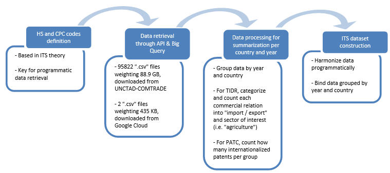

# About the construction of the International Technological Subordination (ITS) dataset using R

Based on the Computational Social Science approach taken, an integrated workflow to retrieve, process, and analyze massive or complex data of interest was built. After looking for big datasets containing information about technology production in an international perspective, we (the authors of the paper) decided to use two sources:

1. **UNCTAD’s COMTRADE Database:** Given the complexity of the business-to-business products traded in sectors of interest (ranging from sophisticated machines to rare components), we decided to track a sample of 49 key commodities, listed in **hs_codes** table contained in **tech_ids** folder of the repo. Then, I downloaded via API all trade operations of selected technified commodities in agriculture, mining, energy, logistics and 4.0 industry sectors, covering all countries and time periods available in the public dataset (204 countries and 35 years). This download process was executed using the R package **comtradr** (Bochtler et al. 2024), which provided access to the COMTRADE database and enabled interaction with the data using HS codes. Downloading all files took around one month of intermittent retrieval with multiple free API keys through the **comtrade_api** file contained in **dr-dp** folder, but bulk download is possible through payment and a similar procedure.
2. **Google’s Patents Public Dataset:** This massive dataset, hosted on Google Cloud, claims to contain highly detailed and tidily categorized patent registers from around the world, from the 19th century to the present. The dataset is updated regularly and is free to access through Google’s BigQuery interface, which requires a Google Cloud account and some basic knowledge of SQL. I prepared two queries to gather and process the necessary data for the analysis, which are available in the **google_query** file contained in **dr-dp** folder. To select only patents relevant to the ITS framework, we identified Cooperative Patent Classification (CPC) codes of interest through the search engine Espacenet and developed by the European Patent Office. These codes were then used to filter the query applied through Google’s interface.

When inspecting **dr-dp** folder, please note that "**DR_**" files contain routines for Data Retrieval while "**DP_**" files contain routines for Data Processing.

As explained above, the workflow I conducted for constructing the ITS dataset for the paper is as follows:

**Figure 1**

*Figure 1: Workflow for constructing the ITS dataset and some key notes about the process.*
